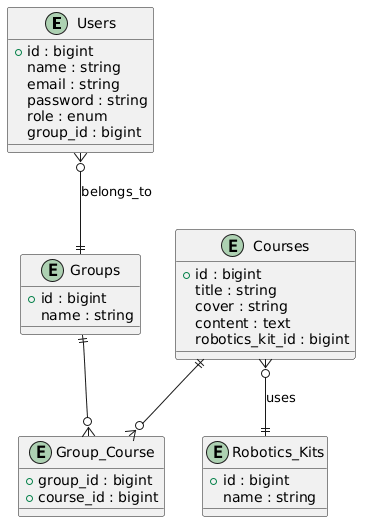

# Robotics Courses Platform

## Project Description
This project was developed using Laravel to manage robotics courses, users, and robotics kits.

The system supports three types of users:
- Administrator
- Teacher
- Student

Courses can be associated with robotics kits and assigned to different learning groups.

## Technologies
- Laravel
- MySQL
- PHP
- FakerPHP
- Git / GitHub

## Database Seeders
The database is populated with test data including:

- 3 users (Administrator, Teacher, Student)
- 3 robotics kits
- 100 generated courses using FakerPHP

## ER Diagram

